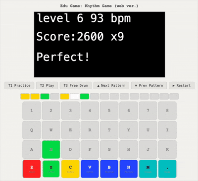

# Ableton Move Game

This is the part of (in progress) final project of Design Educational Game (05418) in Carnegie Mellon University. 

# Demo

We can approximate our core game mechanism on keyboard based interaction without Ableton Move. Try our demo in this [link](http://daehwakim.com/edu-game/rhythm). (Still in progress)

# Contributors

Daehwa Kim, Yujia Liu, Annabelle Chow, Leo Luan

# Credit
The source code is largely based on the amazing open source repository [move-anything](https://github.com/bobbydigitales/move-anything) by [bobbydigitales](https://github.com/bobbydigitales).